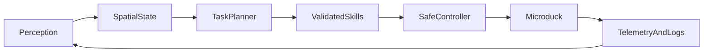

# Microduck RL Learning Plan

This is the stable, learner-facing roadmap for the Microduck RL project.

It is a guide, not an autonomous task queue. The owner performs the commands,
edits, experiments, and decisions. An agent should explain the next action,
wait for explicit permission, review the result, and then update
[`MINUTES.md`](MINUTES.md).

## Project goals

1. Understand the existing Microduck walking policy end to end.
2. Reproduce a baseline walking policy in a controlled way.
3. Learn how to evaluate a policy instead of relying only on reward curves or
   visual impressions.
4. Run a careful A/B experiment where one reward weight changes.
5. Build the practical skills needed for a robotics intern or junior engineer:
   Python, Git, Linux, simulation, controls, RL, experiment design, data
   analysis, and sim-to-real deployment.
6. Later design and train an original Microduck skill from a clear behavior
   specification.

The first milestone is a trustworthy walking experiment, not a novel trick.

## Current project phase

The owner has identified the following Phase 1 sequence:

1. environment setup — done-ish;
2. first walking policy — reported done;
3. change a small number of reward weights;
4. train a second walking policy;
5. evaluate A/B with a reusable walking benchmark;
6. implement and study an original reward function.

“Done” means the activity has happened at least once. It does not necessarily
mean that the result is reproducible, well-labelled, or understood yet. The
remaining work in Phase 1 is therefore about turning an existing first run
into a controlled engineering experiment.

Phase 1 is divided into short gates:

### Phase 1A — Setup and orientation

Status: done-ish.

Confirm the local environment, task registry, repository structure, W&B
access, and training route. The owner should be able to explain why training
uses CUDA while Mac evaluation uses CPU MuJoCo and ONNX Runtime.

### Phase 1B — Baseline walking policy

Status: first policy reportedly trained.

Identify the exact W&B run, task ID, seed if known, environment count,
checkpoint, and code state. A policy without provenance is a useful
demonstration but not yet a reliable experimental baseline.

### Phase 1C — One controlled reward change

Choose one hypothesis, preferably a modest change to action smoothness for the
first experiment. Keep the task, observations, commands, robot model,
actuator model, domain randomization, training budget, and evaluation protocol
constant.

### Phase 1D — Second policy

Train policy B under matched conditions. The purpose is not merely to obtain a
higher reward; it is to learn how a code/configuration change propagates
through training, behavior, metrics, and deployment rehearsal.

### Phase 1E — A/B evaluation

Build a reusable evaluator for the walking task first. “Universal” means
universal across the Phase 1 walking experiments, not a premature framework
for every future skill. The evaluator should eventually accept two policies,
run identical command/trial batteries, and emit comparable CSV/JSON results.

### Phase 1F — Original reward engineering

After the A/B mechanics are understood, write a small reward function from
scratch in
[`src/mjlab_microduck/tasks/mdp.py`](src/mjlab_microduck/tasks/mdp.py).
Start with a pure value-level function that can be tested without a live
simulation, then add the environment wrapper and a focused regression test.
The behavior definition and metric must come before the reward implementation.

## Career alignment: Humanoid

The public Humanoid engineering roles point to several connected skill
families: reinforcement-learning locomotion and loco-manipulation, high-fidelity
simulation, model-based and learning-based control, real-time production
software, ROS2/C++/Python integration, perception and spatial intelligence,
and deployment of PyTorch or multimodal models on robot hardware.

Microduck is a good small-scale laboratory for these skills, but it should not
become a collection of unrelated demos. Each phase should produce an artifact
that demonstrates engineering judgment:

- reproducible training and evaluation commands;
- measured sim-to-real assumptions;
- tests and clear interfaces;
- failure analysis;
- a short technical report;
- a demo that a different engineer can run.

The aim is not to imitate every Humanoid subsystem on a tiny duck. The aim is
to develop transferable habits: define an interface, measure behavior, isolate
variables, understand failure modes, and ship a tested result.

## How we work together

For every milestone:

1. The agent explains the purpose and the smallest useful background.
2. The owner performs the command or edit.
3. The owner shares the output, error, or questions.
4. The agent explains what happened and suggests the next action.
5. After an approved milestone, the agent appends a human-readable entry to
   [`MINUTES.md`](MINUTES.md).

No training, shell commands, file edits, cloud submissions, external uploads,
commits, or hardware actions should be performed without explicit permission
for that action.

## Document roles

### This file: stable roadmap

`MICRODUCK_RL_LEARNING_PLAN.md` contains:

- long-term goals;
- the learning sequence;
- milestone definitions;
- safety rules;
- the intended A/B methodology;
- the future-skills backlog.

It should change only when the project direction or learning sequence changes.

### `MINUTES.md`: chronological project journal

`MINUTES.md` records the evolving history of the project:

- technical milestones and checkpoints;
- commands attempted and their outcomes;
- explanations and learning moments;
- decisions and clarifications;
- project goals and changes in priority;
- hypotheses, rough ideas, and rejected ideas;
- blockers, mistakes, and what was learned from them.

Entries should be chronological and understandable to a human returning to the
project months later. The journal is allowed to contain unfinished ideas; the
stable plan is where the agreed path lives.

## Current repository map

The main walking task is assembled in
[`src/mjlab_microduck/tasks/microduck_velocity_env_cfg.py`](src/mjlab_microduck/tasks/microduck_velocity_env_cfg.py).
It defines the robot, observations, commands, rewards, domain randomization,
curricula, and PPO configuration.

Task registration is in
[`src/mjlab_microduck/tasks/__init__.py`](src/mjlab_microduck/tasks/__init__.py).
The main task ID is:

```text
Mjlab-Velocity-Flat-MicroDuck
```

Custom reward, observation, command, event, and curriculum functions live in
[`src/mjlab_microduck/tasks/mdp.py`](src/mjlab_microduck/tasks/mdp.py).

The robot model and actuator configuration are in:

- [`src/mjlab_microduck/robot/microduck/robot_walk.xml`](src/mjlab_microduck/robot/microduck/robot_walk.xml)
- [`src/mjlab_microduck/robot/microduck_constants.py`](src/mjlab_microduck/robot/microduck_constants.py)
- [`src/mjlab_microduck/actuator/friction_dr_bam.py`](src/mjlab_microduck/actuator/friction_dr_bam.py)

The normal lifecycle is:

```text
task config
    -> PPO training on CUDA
    -> W&B run and checkpoints
    -> visual playback
    -> normalizer-baked ONNX export
    -> Mac CPU/BAM rehearsal
    -> repeatable benchmark
    -> later hardware deployment
```

The policy contract is intentionally fixed across the policy family:

- actor observation: 61 values;
- action output: 14 values;
- control rate: 50 Hz;
- command block: twist, head pose, and body pose.

Do not remove unused command slots or change the observation layout casually.
Runtime policy hot-swapping depends on this contract.

## Compute strategy

The Mac is the local learning and evaluation workstation:

- read and modify code;
- run CPU tests;
- inspect and analyze data;
- use `play` where supported;
- export checkpoints where possible;
- run ONNX Runtime with the BAM actuator rehearsal;
- create plots, videos, and reports.

Large-scale PPO training belongs on a Linux/NVIDIA CUDA machine or a managed
GPU service. Hugging Face Jobs is the repository-supported remote route; Colab
is acceptable for initial experiments if it is the available option.

The first action on any CUDA machine is the inexpensive smoke test:

```bash
uv run train Mjlab-Velocity-Flat-MicroDuck \
    --env.scene.num-envs 64 \
    --agent.max_iterations 5
```

This command is written here as a future exercise. It must not be run by an
agent without explicit permission.

## Milestone 1: understand one policy step

Learn these concepts in context:

- observation;
- action;
- reward;
- episode and termination;
- policy and checkpoint;
- PPO iteration;
- domain randomization;
- curriculum;
- simulation timestep and control rate.

Trace one step through the repository:

1. a command is sampled;
2. the environment constructs the actor observation;
3. the policy emits 14 joint-position actions;
4. the BAM actuator and MuJoCo advance the robot;
5. rewards and termination signals are computed;
6. PPO collects rollout data and updates the neural network.

Completion check:

Write a short explanation in your own words. It should explain what the
policy sees, what it controls, why the critic has privileged information, and
why training at 50 Hz is different from the lower-level physics timestep.

## Milestone 2: reproduce and label a baseline

Before changing rewards, run the existing flat walking task with a fixed seed
and a named run. The exact command will be chosen and executed by the owner
after the compute route is confirmed.

Record:

- task ID;
- Git commit and dirty files;
- seed;
- number of parallel environments;
- GPU and training duration;
- W&B run URL;
- checkpoint selected for evaluation;
- mean reward, episode length, and individual reward terms.

Terminology checkpoint:

`model_3000.pt` normally refers to PPO iteration 3000, not 3,000 individual
physics steps. This walking runner collects 24 environment steps per iteration.
Always state both iteration count and environment count.

Do not mix the pre-existing robot appearance change or unrelated notes into a
reward-weight comparison.

## Milestone 3: inspect the baseline

Use three layers:

1. W&B curves and reward-term inspection;
2. visual playback of an exact checkpoint;
3. exported ONNX rehearsal on the Mac.

The safe export path is
[`scripts/export.py`](scripts/export.py), which calls
[`src/mjlab_microduck/export.py`](src/mjlab_microduck/export.py) and embeds the
observation normalizer in the ONNX graph.

The CPU sim-to-real rehearsal is
[`scripts/infer_policy.py`](scripts/infer_policy.py). For current 61-D
policies, use its `--new-cmd-obs` mode.

Define “good walking” before tuning:

- survival time and fall rate;
- commanded versus achieved velocity error;
- trunk height and tilt;
- horizontal drift;
- action-rate/jitter;
- whether behavior remains stable across multiple command cases.

Reward improvement alone is not proof that the robot improved.

## Milestone 4: design the first benchmark

Do not begin with a universal evaluator. Different skills need different
success definitions. Start with a walking-specific, headless benchmark after
the manual baseline inspection is understood.

The first command battery should stay within the training distribution:

- zero command / standing;
- forward commands around 0.2 and 0.4 m/s;
- modest positive and negative lateral commands;
- modest positive and negative turn-in-place commands.

Each trial should eventually record:

- policy and checkpoint;
- seed and command;
- duration and survival time;
- termination reason and fall flag;
- velocity RMSE;
- trunk height and tilt;
- horizontal drift;
- action-rate RMS.

The benchmark should produce machine-readable CSV/JSON and remain usable on
the Mac CPU. Qualitative video or playback remains part of the evaluation.

## Milestone 5: first controlled A/B experiment

Policy A is the baseline. Policy B changes exactly one interpretable reward
factor while preserving:

- task ID;
- seed policy;
- environment count;
- PPO settings;
- command ranges;
- observation layout;
- robot XML;
- BAM actuator model;
- domain randomization;
- evaluation scenarios.

The recommended first hypothesis is:

> A moderately stronger action-rate penalty may reduce action jitter while
> preserving survival and velocity tracking.

The live walking configuration currently ramps `action_rate_l2` from `-0.1`
to `-1.0` by approximately iteration 1500. Any B change must state whether it
tests the early bootstrapping stage, the final gait, or the whole schedule.

Compare:

Primary:

- survival/fall rate;
- achieved velocity RMSE.

Secondary:

- action-rate RMS;
- trunk oscillation;
- horizontal drift;
- episode length;
- individual weighted reward terms.

If one pair is informative, repeat with multiple seeds before making a strong
claim. A result is inconclusive when only total reward changes or when the
training budgets differ.

## Milestone 6: implement an original reward function

This is the first deliberate reward-engineering exercise, separate from
tuning an existing scalar.

Choose a small measurable behavior, such as reduced action change, a posture
property, or a carefully defined walking quality. Then:

1. describe the desired behavior and an undesirable loophole;
2. decide whether the signal is a reward, cost, gate, or termination;
3. write a pure function over tensors or values;
4. add unit tests for the expected peak, sign, scale, and edge cases;
5. connect it to the walking config at a small weight;
6. run a smoke test and inspect its weighted reward log;
7. compare behavior against the pre-change policy.

The sign convention in this repository is important: built-in cost functions
usually return non-negative costs and receive negative weights, while
self-negating Microduck penalties return non-positive values and receive
positive weights. The function's actual return values decide the convention.

## Milestone 7: write the engineering report

Each experiment report should contain:

1. question and hypothesis;
2. exact code/config difference;
3. training setup and provenance;
4. evaluation protocol;
5. quantitative results;
6. representative video or plots;
7. failures and limitations;
8. decision for the next experiment.

This is as important as the final score. It demonstrates engineering habits:
reproducibility, measurement, debugging, communication, and awareness of
uncertainty.

## Phase 2 — technical expansion

Phase 2 begins only after the Phase 1 loop can be explained and reproduced.
It is intentionally a set of branches rather than one giant curriculum.

### Phase 2A — Robotics software foundations

Learn Linux development, modern Python structure, introductory C++, Git
branches and reviews, Docker basics, logging, configuration, testing, and
profiling. Connect each topic to Microduck rather than studying it in
isolation.

Possible artifact: a small tested command-line tool that reads a policy
benchmark result, summarizes it, and fails clearly on malformed input.

### Phase 2B — Control and robot systems

Study coordinate frames, kinematics, dynamics, PID/PD control, state
estimation, actuator limits, timing, latency, safety states, and real-time
loops. Relate the 50 Hz policy loop, 200 Hz physics stepping, BAM actuator,
and eventual robot runtime.

Possible artifact: a documented timing/latency experiment or a simulation
versus actuator-response comparison.

### Phase 2C — ROS2 and navigation

Introduce ROS2 nodes, topics, services, actions, transforms, bags, launch
files, and lifecycle. Then study localization, mapping, SLAM, planning,
obstacle avoidance, and recovery behaviors.

This branch should use the smallest useful navigation environment first. A
good demo would be a simulated or desk-scale command pipeline rather than
immediately attempting full humanoid autonomy.

Possible artifact: a ROS2 node that publishes a command, records telemetry,
and replays a deterministic run with a clear interface.

### Phase 2D — Perception and spatial intelligence

Study camera and depth data, calibration, point clouds, coordinate transforms,
tracking, occupancy representations, and scene understanding. SLAM belongs
here when the control and ROS2 foundations are ready.

Possible artifact: a perception pipeline that turns sensor input into a
measured spatial representation and visualizes failure cases.

### Phase 2E — VLM/VLA and embodied AI

Treat VLM/VLA work as an integration problem, not just a model download.
Learn multimodal inputs, action interfaces, data collection, demonstrations,
inference latency, safety filtering, and the boundary between high-level
reasoning and low-level control.

Possible artifact: a constrained high-level command system whose outputs map
to a small, safe set of already-tested Microduck skills. The language model
must not directly bypass the low-level safety and policy interfaces.

### Phase 2F — Full application demo

Combine only components that are individually understood:



Candidate demos include a commandable behavior sequencer, a perception-guided
interaction, or a small autonomous task with explicit fallback behavior.
The demo should show interfaces, observability, and safe failure—not only a
video of a successful run.

## Choosing between branches

When a new idea appears, capture it in `MINUTES.md` and classify it:

- **Now:** directly advances the current Phase 1 gate;
- **Next:** useful immediately after Phase 1;
- **Spike:** a time-boxed experiment that answers one uncertainty;
- **Backlog:** interesting but currently unblocked and non-essential;
- **Drop:** not worth the cost or not aligned with the project.

Use a short decision card:

```text
Idea:
Why now:
Skill or Humanoid role it develops:
Smallest useful experiment:
Required hardware/compute:
Success metric:
Time limit:
Kill condition:
Next decision:
```

Ideas may change the roadmap. They should do so explicitly, with a recorded
reason and a decision about which current milestone is paused or replaced.

## Future skill backlog

Only choose a unique skill after the walking loop is understood. Candidate
directions include:

- stronger push recovery;
- rough-terrain walking;
- improved turning;
- head-pose control;
- sit/stand transitions;
- a new maneuver with a clearly defined landing state;
- actuator or sim-to-real robustness studies.

Every new skill starts with:

1. behavior specification;
2. success and failure metrics;
3. initial-state and command design;
4. likely reward loopholes;
5. a minimal smoke test;
6. only then reward implementation.

## Safety and reproducibility rules

- Do not touch hardware until simulation and ONNX rehearsal are understood.
- Never hand-convert a checkpoint to ONNX.
- Never compare different checkpoints, task variants, XML models, command
  distributions, or training budgets as though only one variable changed.
- Do not delete command slots to simplify an environment.
- Keep experiment changes small and reversible.
- Treat failures as useful data and record them in `MINUTES.md`.
- Before each autonomous agent action, obtain explicit permission from the
  owner.
